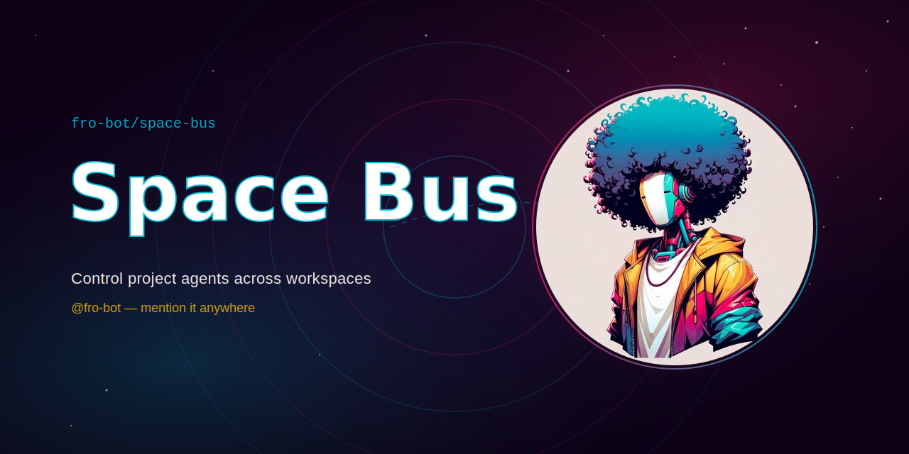

<div align="center">



# @fro.bot/space-bus

> Control project agents across workspaces

[](https://www.npmjs.com/package/@fro.bot/space-bus) [](https://github.com/fro-bot/space-bus/actions) [](LICENSE)

[What it is](#what-it-is) · [Install](#install) · [Configure](#configure) · [Tools](#tools) · [Library surface](#library-surface) · [Claude Desktop](#claude-desktop) · [Development](#development)

</div>

---

## What it is

Workspace agent bus for OpenCode. A control agent — an ordinary OpenCode TUI running with this plugin installed — tasks dedicated agents in each project on your roster over a single `opencode serve`/`harness serve` instance, using per-request directory routing. A thin stdio MCP facade exposes the same tools to Claude Desktop.

**Prerequisites**: an `opencode serve` or `harness serve` instance already running; Bun if you're using the Claude Desktop MCP bin (`bunx`).

## Install

Add the plugin to `opencode.json`:

```json
{
  "plugin": ["@fro.bot/space-bus"]
}
```

Then add a `spacebus.json` roster in the same directory:

```json
{
  "server": {
    "baseUrl": "http://127.0.0.1:4096"
  },
  "projects": [
    {
      "name": "my-project",
      "path": "~/src/my-project",
      "description": "My project's agent runtime and API"
    }
  ]
}
```

## Configure

Space Bus reads a `spacebus.json` roster from the workspace directory (the directory OpenCode was launched in).

Fields:

- `server.baseUrl` — must resolve to localhost (`127.0.0.1`, `::1`, or `localhost`); non-local hosts are refused so bus credentials never leave the machine.
- `projects[].name` — identifier passed to `bus_task`'s `project` argument.
- `projects[].path` — filesystem path to the project; supports `~` expansion.
- `projects[].description` — shown in `bus_roster` output.

Set `SPACE_BUS_CONFIG` to override roster discovery — it must be an absolute path or start with `~` (URLs and bare-relative paths are rejected). The roster is read fresh on every tool call — no caching, so edits apply immediately.

## Tools

- `bus_roster` — List the space-bus manifest projects with live session status per project.
- `bus_task` — Dispatch a prompt to an agent in the given space-bus manifest project, or steer an existing session by passing `sessionId` (answers its pending question, else sends a follow-up prompt). Returns immediately; does not wait for completion. Alongside the formatted text, results carry structured `{sessionId, project, mode}` metadata — plugin `ToolResult.metadata` on the tool surface, MCP `structuredContent` on the stdio surface — for callers that want the dispatch outcome without parsing the string.
- `bus_status` — Report a space-bus session's status plus a summary of its latest todo and diff. Also reports when the session is blocked on an interactive question awaiting a reply.
- `bus_result` — Return a completed space-bus session's final assistant message and diff. Errors if the session is still running — use `bus_status` to check first.
- `bus_wait` — Block until any of the given sessions needs attention (completes, blocks on a question, fails, or is not found) or a bounded timeout elapses. Returns each watched session's normalized state and which session(s) woke the wait; on timeout returns the current snapshot, not an error.
- `bus_registry` — Manage the roster registry: list registered rosters, create/register/unregister rosters, set the default, select an active roster for this connector session (`use`, MCP only), and add/remove/update projects on a registered roster. `set-default` also becomes the MCP ambient-resolution fallback (see below) once `SPACE_BUS_CONFIG` is unset.

All five `bus_*` tools accept an optional `roster` param (a registry name — see `bus_registry`) to target a roster other than the ambient one, and every tool result opens with a `roster: <name-or-path>` line naming the roster it resolved against, on both surfaces. Resolution precedence:

- **Plugin surface:** explicit `roster` param > workspace directory (`ctx.directory`).
- **MCP surface:** explicit `roster` param > connector-session active roster (`bus_registry use`) > `SPACE_BUS_CONFIG` (ambient) > registry default (`bus_registry set-default`), consulted only when `SPACE_BUS_CONFIG` is unset > an actionable error listing the available rosters.

## Managed server

Two roster modes for `server`, mutually exclusive:

- `server.baseUrl` — externally-managed, attach-only. Today's default behavior: you start `opencode serve`/`harness serve` yourself; the plugin just connects.
- `server.managed` — plugin-managed lifecycle. The plugin spawns and supervises the server for you.

```json
{
  "server": {
    "managed": {
      "command": ["harness", "serve"],
      "cwd": "~/src/my-workspace",
      "port": 0
    }
  },
  "projects": [{ "name": "my-project", "path": "~/src/my-project" }]
}
```

`command`, `cwd`, and `port` are all optional (defaults: `harness serve` — set `managed.command` for a custom command such as `opencode serve` — the roster's directory, and an ephemeral port, respectively).

First-caller-spawns: whichever consumer touches the managed roster first spawns the server on demand — a generated password and a 0600 discovery file land under the state dir (`$XDG_STATE_HOME|~/.local/state/space-bus/<hash>/discovery.json`), every subsequent caller attaches to the same instance. It's a persistent daemon, not a request-scoped process — it outlives the caller and there's no auto-restart if it dies; the next `ensure` call notices the stale discovery file and heals by spawning fresh.

CLI (`space-bus`, wraps the same lifecycle):

```sh
space-bus serve [--foreground] [--json] [--config <path>]
space-bus status [--json] [--config <path>]
space-bus stop [--json] [--config <path>]
```

MCP is attach-only by default — it never spawns. Set `SPACE_BUS_MCP_SPAWN=1` in the MCP server's env to opt it into ensuring a managed roster's server on startup.

Security posture: each spawn gets a freshly generated password (never reused, never in argv, never logged); the loopback guard travels with the discovery handshake, so an attached endpoint is re-validated as localhost-only regardless of source. Same-user process compromise is out of scope — anyone who can read your state dir or ptrace the child already has what they need.

Programmatic consumers (e.g. Mothership) that want to drive the lifecycle directly without the CLI can import `@fro.bot/space-bus/managed-server` (Node-only; `ensureServer`/`serverStatus`/`stopServer`).

## `space-bus service` (macOS, launchd v1)

Reboot-persistent daemon on top of the managed server: registers a per-user launchd agent that wraps `serve --foreground`, so the roster's server survives host reboots and crashes without a live operator noticing it died.

```sh
space-bus service install [--json] [--config <path>]    install the launchd agent, start it now
space-bus service uninstall [--json] [--config <path>]  bootout the job and remove the plist
space-bus service status [--json] [--config <path>]     installed / loaded / running, with pid
space-bus service stop [--json] [--config <path>]       bootout the loaded job (plist stays)
space-bus service start [--json] [--config <path>]      bootstrap + kickstart the job
```

Semantics:

- Starts at **login**, not boot — it's a `gui/$UID` launchd agent, not a system daemon.
- Restarts only on abnormal exit (`KeepAlive.SuccessfulExit=false`), consuming the existing `serve --foreground` exit-code contract (0 = deliberate stop, no restart; 1 = death, restart). Restarts are throttled to once per 10s to avoid a crash loop.
- `service stop` deregisters the job (`bootout`) but leaves the plist in place; `service start` re-registers it (`bootstrap` + `kickstart`). A stopped service comes back automatically at the next login (`RunAtLoad`) unless you `service start` it back sooner — there's no persistent "disabled" latch in v1.
- Logs land at the roster's state dir: `service.log` (stdout) / `service.err.log` (stderr), created 0600.
- Upgrades: the plist pins absolute paths to the runtime and CLI entry resolved at install time. After a version bump (or if you moved/reinstalled the runtime), re-run `space-bus service install` — it's idempotent and refreshes the pinned paths.
- macOS only in v1; every verb fails fast with an explicit error on other platforms.
- `install`/`uninstall` are explicit operator actions only — nothing auto-installs the service on your behalf.

## Library surface

Experimental subpath exports expose the bus's internals directly — the functions the four tools run on, plus the managed-server lifecycle and the attach resolver — for renderers and other consumers that want structured state instead of formatted strings. Subpaths are experimental: shapes may change in minor releases; pin the version if you adopt them.

- `@fro.bot/space-bus/core` — browser-safe; no Node builtins, no ambient env reads. Every exported function takes a `context: BusContext` (`{ roster, credentials? }`) that you build yourself and pass in — core never resolves it for you. Includes `snapshot()`, a one-call composite of roster + per-project status + pending questions with bounded fan-out. Session-content primitives:
  - `messages(sessionId, { context, limit? })` — bounded full-message read. Resolves session ownership from the roster (never a caller-supplied directory), fetches `GET /session/:id/message?limit=N` (default 20, hard maximum 200 — `limit` must be a finite positive integer at or under the maximum; `0`, negative, fractional, `NaN`, `Infinity`, and over-maximum values are rejected before any fetch). Returns `{ sessionId, project, messages: [{ id?, role, createdAt?, parts: [{ type, text? }] }] }` in the order the server returns them — `id`/`createdAt` are the message's stable identity/ordering metadata (from the envelope's `info.id`/`info.time.created`), and only those explicit fields plus parsed `parts` cross the boundary; unknown envelope fields are dropped. No directory/credential fields in the result.
  - `questions(target, { context })` — complete project- or session-scoped pending-question read. `target` is `{ project }` or `{ sessionId }` — exactly one; both-present or neither-present is rejected before any fetch. Returns `{ questions: [{ requestId, sessionId, questions: [{ header?, question, multiple, custom, options: [{ label, description? }] }] }] }` — one entry per `/question` request, each carrying its **full nested subquestion list** (a single request can ask multiple subquestions), not just the first one.
  - `answerQuestion({ sessionId, requestId, answers }, { context })` — explicit question answer. Runtime-validates `answers` is a non-empty `string[][]` (rejects non-arrays, non-array rows, and non-string cells) before any fetch; verifies `requestId` actually belongs to a pending question on `sessionId` (fetched fresh from `GET /question`, parsed with the full pending-question schema) before sending the reply — a `requestId` for a different session is refused with no mutation; and verifies `answers.length` equals that request's subquestion count before sending — mismatched cardinality is refused with no mutation. Sends the complete `string[][]` `answers` payload to `POST /question/:requestId/reply`. `requestId` must be the question's own id (`que_...`), never an SSE envelope id (`evt_...`).
  - `dispatch(args, opts)` gained an optional `args.onPendingQuestion: "question-reply" | "blocked"` (default `"question-reply"`, backward-compatible with 0.13.1); `toDispatchArgs` validates and preserves this field, rejecting any other value. Steering a session that has a pending question with `onPendingQuestion: "blocked"` returns `{ ok: true, mode: "blocked", sessionId, project, requestId }` and sends **neither** a question reply **nor** a follow-up prompt — for callers (like `ide_dispatch_prompt`) that must never silently reinterpret prompt text as a question answer. `"blocked"` is fail-closed: if `GET /question` returns a non-2xx status or an unparseable body, the pending-question state is unknown and the call returns a stable `Result` error instead of falling through to any mutation. The default `"question-reply"` policy (omitted, or passed explicitly) preserves the original fail-open v0.13.1 behavior unchanged, including on an unreadable `/question` response (falls through to a normal follow-up prompt).
- `@fro.bot/space-bus/config` — Node-only. `loadContext(directory?)` reads `spacebus.json` (honoring `SPACE_BUS_CONFIG` the same as the plugin) and returns a ready-to-use `BusContext`, with per-project `exists` flags and env-derived credentials attached. Build a fresh context per call; it's per-call/short-lived by contract, not meant to be cached across filesystem changes. `loadContextForRoster(name)` resolves a registered roster name instead (via `registry.resolveRosterByName`) through the same read/attach/credentials pipeline, returning the canonical registered name alongside the context and path. `loadContextForRosterPath(path)` — experimental, like its siblings — loads a `BusContext` from an *already-resolved* roster path, skipping name resolution entirely; callers that resolve a name once (to decide whether to `ensureServer()`) use this to avoid a second, TOCTOU-prone re-resolution of the same name.
- `@fro.bot/space-bus/contract` — the zod schemas (and inferred types) behind the OpenCode API and `BusContext`, for consumers hitting the server directly and wanting the same shapes. Schemas are zod v4.
- `@fro.bot/space-bus/format` — the pure formatters the tools use to render output, for tool-identical text.
- `@fro.bot/space-bus/managed-server` — Node-only. The managed-server lifecycle (`ensureServer`/`serverStatus`/`stopServer`) for consumers driving spawn/attach/stop directly — see [Managed server](#managed-server).
- `@fro.bot/space-bus/attach` — browser-safe. `resolveManagedServer(workspaceDir, seams)` resolves a managed roster's running endpoint by reading the discovery file through injected filesystem/env/crypto seams — re-checking the localhost guard and probing liveness — so an external attacher such as a Tauri webview can attach without any `node:*` imports or reimplementing the discovery contract. Returns `{ baseUrl, credentials, alive }` or an actionable error.

Node example (`/config` + `/core`):

```ts
import { loadContext } from "@fro.bot/space-bus/config";
import { snapshot } from "@fro.bot/space-bus/core";

const context = loadContext(); // resolves spacebus.json from SPACE_BUS_CONFIG or a directory you pass — no cwd fallback
const result = await snapshot({ context });
if (result.ok) {
  for (const project of result.projects) {
    console.log(project.name, project.exists);
  }
}
```

Browser consumers: `/core`, `/contract`, `/format`, and `/attach` are browser-safe (their module graphs are bundle-tested in CI to exclude `node:*` imports and never reach `/config`). `/config` is Node-only — browser code can't call `loadContext`, so credentials must be injected explicitly by whatever server-side process builds the `BusContext` (never read ambiently by core). The localhost guard travels with the context: it's re-checked at core's single validation gate on every call, so a context built from a non-local `baseUrl` is rejected there, not just at config's load time.

## Claude Desktop

```json
{
  "mcpServers": {
    "space-bus": {
      "command": "bunx",
      "args": ["--package=@fro.bot/space-bus", "space-bus-mcp"],
      "env": {
        "SPACE_BUS_CONFIG": "/absolute/path/to/spacebus.json"
      }
    }
  }
}
```

Requires `opencode serve`/`harness serve` already running on the roster's `baseUrl`.

## Development

```sh
bun install
bun run fixture       # generates gitignored fixtures/dev-workspace/ (opencode.json + spacebus.json)
harness serve --port 4096 &    # or: opencode serve --port 4096
opencode --dir fixtures/dev-workspace   # or open that directory directly
bun run smoke          # canary: directory-routing isolation against the live server
bun run test
bun run typecheck
bun run lint
bun run dev             # watch build to dist/
```

`@opencode-ai/*` versions are pinned lockstep with the OpenCode CLI. Upgrade both together. Set `OPENCODE_SERVER_PASSWORD` (and optionally `OPENCODE_SERVER_USERNAME`) to enable HTTP Basic auth on every bus request.

## Implementation notes

- The session store is global across directory headers: `GET /session/{id}` resolves regardless of which project directory is sent. The bus attributes a session to its owning project via the session's own `directory` field, not the probe header. `GET /session` (list) and `/session/status` are directory-scoped.
- Upstream opencode #30127 (v1.16.0) zeroes session-level diff summaries, so `GET /session/{id}/diff` always returns `[]`. Per-turn diffs on user messages (`GET /session/{id}/message`) stay intact and include untracked files, so `bus_status`/`bus_result` aggregate those instead (last turn wins per file, à la upstream PR #33444). Harness builds ≥`1.17.13+harness.ee55e157` carry #33444 directly, so `GET /session/{id}`'s `summary.diffs` field is populated and serves diffs without per-turn aggregation (still labeled `diffSource: "session"`); stock binaries leave it empty and fall through to per-turn aggregation. `GET /vcs/status` remains a last-ditch repo-wide fallback, labeled *working tree*.
- `/session/status` can report a session idle a beat before its final message is queryable; `scripts/smoke.ts` absorbs this with a bounded retry on the message fetch.
- Dogfooding surfaced a need for a steering path that isn't raw API — delegates block on interactive questions. That steering path ended up as an optional `sessionId` on `bus_task` rather than a fifth tool: passing it answers a pending question or sends a follow-up prompt on an existing session. `bus_status` also surfaces pending interactive questions (`pendingQuestion` / a `blocked:` line) so a blocked delegate isn't mistaken for one actively working.

## Releasing

PRs land a changeset via `bunx changeset`. On merge to `main`, CI opens a version PR; merging that PR publishes to npm through trusted publishing (OIDC) — no `NPM_TOKEN` involved.

---

<div align="center">

<sub>Part of the <a href="https://github.com/fro-bot">Fro Bot</a> ecosystem</sub>

</div>
